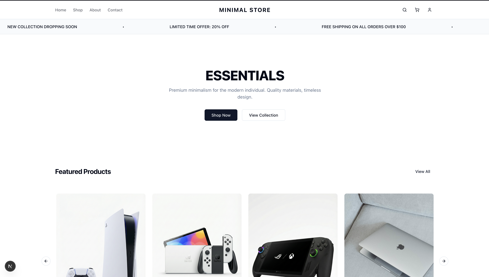
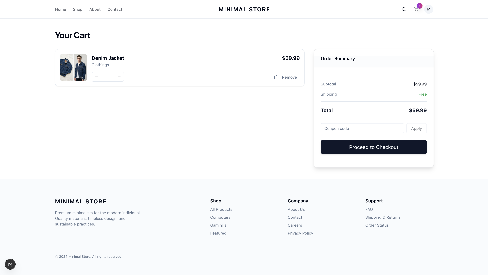
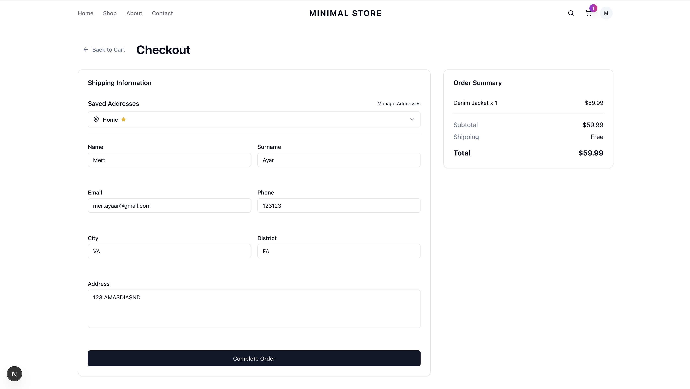
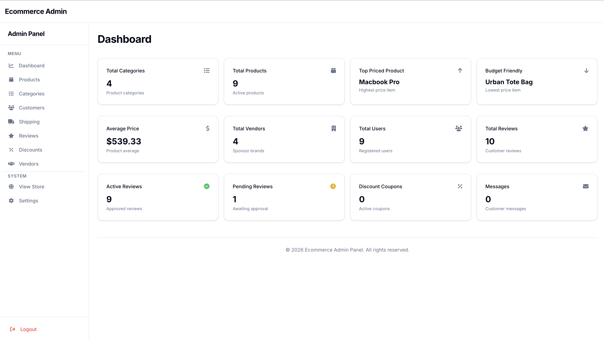
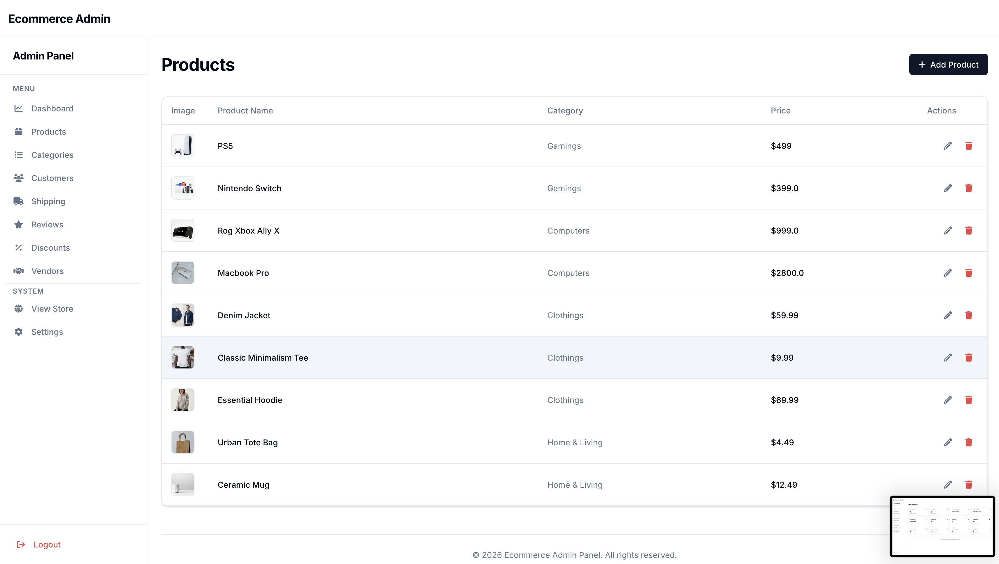

# 🛒 Ecommerce Microservices Platform

> A full-stack e-commerce application built with .NET Microservices, Next.js, and modern cloud technologies.

## 📑 Table of Contents

- [📸 Screenshots](#-screenshots)
- [✨ Features](#-features)
- [🏗️ Architecture](#️-architecture)
- [🚀 Getting Started](#-getting-started)
- [🔑 Default Credentials](#-default-credentials)
- [🌐 Service Ports](#-service-ports)
- [📁 Project Structure](#-project-structure)
- [🛠️ Technologies](#️-technologies)
- [📝 Configuration](#-configuration)
- [🤝 Contributing](#-contributing)
- [📄 License](#-license)


## 📸 Screenshots

### Customer Frontend (Next.js)






### Admin Panel (ASP.NET MVC)





---

## ✨ Features

- 🏪 **Customer Storefront** - Modern Next.js frontend with responsive design
- 👨‍💼 **Admin Panel** - Full-featured admin dashboard for management
- 🔐 **Authentication** - IdentityServer4 with JWT tokens
- 🛍️ **Product Catalog** - MongoDB-based product management
- 🛒 **Shopping Cart** - Redis-backed cart functionality
- 💳 **Order Management** - Complete order processing workflow
- 🎫 **Discount Codes** - Coupon and discount management
- 🖼️ **Cloud Image Storage** - Google Cloud Storage integration

---

## 🏗️ Architecture

```
┌─────────────────────────────────────────────────────────────────┐
│                        CLIENTS                                   │
├─────────────────────┬───────────────────────────────────────────┤
│   Next.js Frontend  │           ASP.NET MVC Admin Panel          │
│   (localhost:3000)  │           (localhost:7210/Admin)           │
└─────────┬───────────┴───────────────────┬───────────────────────┘
          │                               │
          ▼                               ▼
┌─────────────────────────────────────────────────────────────────┐
│                    BFF (Backend for Frontend)                    │
│                       (localhost:5500)                           │
└─────────────────────────────┬───────────────────────────────────┘
                              │
                              ▼
┌─────────────────────────────────────────────────────────────────┐
│                    Ocelot API Gateway                            │
│                       (localhost:5000)                           │
└─────────────────────────────┬───────────────────────────────────┘
                              │
     ┌────────────────────────┼────────────────────────┐
     ▼                        ▼                        ▼
┌──────────┐           ┌──────────┐            ┌──────────┐
│ Catalog  │           │  Order   │            │  Other   │
│ :7220    │           │  :7222   │            │ Services │
│ MongoDB  │           │SQL Server│            │          │
└──────────┘           └──────────┘            └──────────┘
```

---

## 🚀 Getting Started

### Prerequisites

- [.NET 9 SDK](https://dotnet.microsoft.com/download/dotnet/9.0)
- [Node.js 18+](https://nodejs.org/)
- [SQL Server](https://www.microsoft.com/sql-server) (or Docker containers)
- [MongoDB](https://www.mongodb.com/try/download/community)
- [Redis](https://redis.io/download/) (for shopping cart)
- [PostgreSQL](https://www.postgresql.org/) (for Message service)

### Installation

1. **Clone the repository**
   ```bash
   git clone https://github.com/YOUR_USERNAME/Ecommerce.git
   cd Ecommerce
   ```

2. **Configure environment variables**
   ```bash
   cp .env.example .env
   # Edit .env with your database passwords and settings
   ```

3. **Install Next.js dependencies**
   ```bash
   cd Clients/Ecommerce.NextJS
   npm install
   cd ../..
   ```

4. **Run database migrations**
   ```bash
   # Order Service
   dotnet ef database update --project Services/Order/Infrastructure/Ecommerce.Order.Persistance
   
   # Cargo Service
   dotnet ef database update --project Services/Cargo/Ecommerce.Cargo.DataAccessLayer
   
   # Review Service
   dotnet ef database update --project Services/Review/Ecommerce.Review
   ```

5. **Start all services**
   ```bash
   chmod +x start_all.sh
   ./start_all.sh
   ```

6. **Access the applications**

   | Application | URL |
   |-------------|-----|
   | 🌐 Customer Frontend | http://localhost:3000 |
   | 👨‍💼 Admin Panel | https://localhost:7210/Admin |
   | 🔐 Identity Server | http://localhost:5001 |
   | 🚪 API Gateway | http://localhost:5000 |

---

## 🔑 Default Credentials

| Role | Username | Password |
|------|----------|----------|
| **Admin** | `admin` | `Admin123$` |
| **Customer** | `customer` | `Customer123$` |

> ⚠️ **Important**: Change these credentials in production!

---

## 🌐 Service Ports

| Service | Port | Database |
|---------|------|----------|
| Identity Server | 5001 | SQL Server |
| API Gateway (Ocelot) | 5000 | - |
| BFF | 5500 | Redis |
| Catalog | 7220 | MongoDB |
| Discount | 7221 | SQL Server |
| Order | 7222 | SQL Server |
| Cargo | 7223 | SQL Server |
| Cart | 7224 | Redis |
| Images | 7227 | Google Cloud Storage |


---

## 📁 Project Structure

```
Ecommerce/
├── Clients/
│   ├── Ecommerce.NextJS/          # Customer frontend (Next.js)
│   └── Ecommerce.WebUI/           # Admin panel (ASP.NET MVC)
├── Services/
│   ├── Identity/                   # IdentityServer4 authentication
│   ├── Catalog/                    # Product catalog (MongoDB)
│   ├── Cart/                       # Shopping cart (Redis)
│   ├── Order/                      # Order management (SQL Server)
│   ├── Cargo/                      # Shipping management
│   ├── Discount/                   # Coupon codes
│   ├── Images/                     # Image upload (GCS)
│   └── BFF/                        # Backend for Frontend
├── Gateways/
│   └── Ecommerce.OcelotGateway/    # Ocelot API Gateway
├── .env.example                    # Environment template
├── start_all.sh                    # Startup script
└── README.md
```

---

## 🛠️ Technologies

| Layer | Technology |
|-------|------------|
| **Frontend** | Next.js 14, React, Tailwind CSS |
| **Admin Panel** | ASP.NET Core MVC, Tailwind CSS |
| **API Gateway** | Ocelot |
| **Authentication** | IdentityServer4, JWT, OAuth 2.0 |
| **Databases** | SQL Server, MongoDB, PostgreSQL, Redis |
| **Cloud Storage** | Google Cloud Storage |
| **Communication** | REST APIs |

---

## 📝 Configuration

### Required Environment Variables

Copy `.env.example` to `.env` and configure these essential settings:

```env
# Service URLs
IdentityServerUrl="http://localhost:5001"
OcelotUrl="http://localhost:5000"
BffUrl="http://localhost:5500"

# Database Passwords (replace with your own)
ConnectionStrings__DefaultConnection="Server=localhost;Database=...;Password=YOUR_PASSWORD;..."

# MongoDB
DatabaseSettings__ConnectionString="mongodb://localhost:27017"

# Redis
RedisSettings__Host="localhost"
RedisSettings__Port="6379"
```

See `.env.example` for the complete list of configuration options.

---

## 🤝 Contributing

1. Fork the repository
2. Create your feature branch (`git checkout -b feature/AmazingFeature`)
3. Commit your changes (`git commit -m 'Add some AmazingFeature'`)
4. Push to the branch (`git push origin feature/AmazingFeature`)
5. Open a Pull Request

---

## 📄 License

This project is licensed under the MIT License - see the [LICENSE](LICENSE) file for details.

---

## 👤 Author

**Mert Ayar**

- GitHub: [@mertayaar](https://github.com/mertayaar)
- LinkedIn: [LinkedIn Profile](https://linkedin.com/in/mertayaar)

---

<p align="center">
  Made with ❤️ using .NET Microservices
</p>
